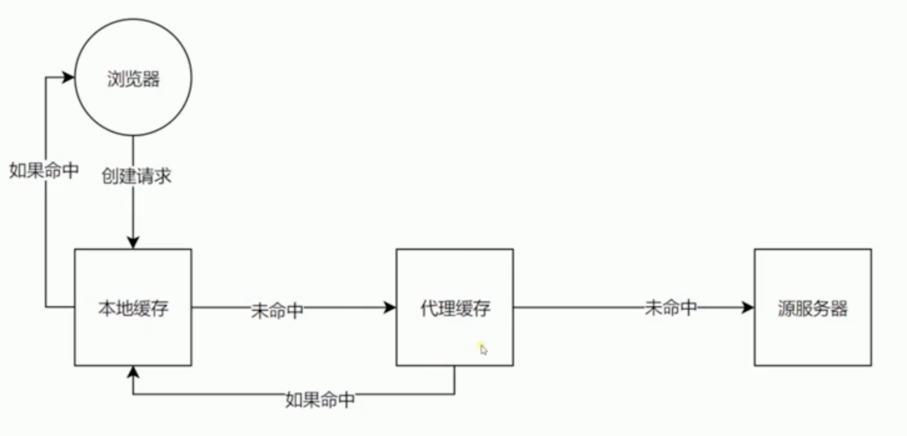

## 3-1 CORS 跨域请求的限制与解决

1) jsonp - 利用 link, script, img 标签允许跨域的原理来实现的。

标签的src属性并不被同源策略所约束.


### CORS 跨域资源共享 Cross-Origin Resource Sharing)
跨域资源共享(CORS) 是一种机制，它由一系列传输的HTTP头组成，这些HTTP头决定浏览器是否阻止前端 JavaScript 代码获取跨域请求的响应。

2) 为什么会有 CORS 预请求？
“需预检的请求”要求必须首先使用 OPTIONS   方法发起一个预检请求到服务器，以获知服务器是否允许该实际请求。"预检请求“的使用，可以避免跨域请求对服务器的用户数据产生未预期的影响。


- 请求头限制，不允许自定义头 header

- 允许的方法 GET\POST\Head

- 允许 Content-Type 内容类型
    - text/plain 文本
    - multipart/form-data 
    - application/x-www-form-urlencoded 表单
    - 除了这三个之外也需要预请求验证
    
```
'access-control-allow-origin': 'http://localhost:3000',

// 允许自定义头
'access-control-allow-headers': 'X-Test-CORS',

// 允许的方法
'access-control-allow-methods': 'PUT, POST, Delete, GET',

// 最长时间，10s 内再发请求就不用预请求了
'access-control-max-age': '10'
// 'access-control-allow-origin': '*'
```    

## 3-2 csp 内容安全策略

"内容安全策略"(Content Security Policy,缩写 CSP)

作用:
- 限制资源获取
- 报告资源获取权限

限制方式
- default-src 限制全局
- 制定资源类型

资源类型: 
- connect-src 请求发向目标
- manifest-src
- img-src 图片
- font-src
- frame-src
- script-src 脚本
- style-src 

限制行内脚本执行：
'Content-Security-Policy': 'default-src http: https:'

只能加载本域名下的 js

服务端设置
```
 res.writeHead(200, {
      'Content-Type': 'text/html',
      // 内容安全策略
      'Content-Security-Policy': 'default-src http: https:' // 限制行内脚本执行
      'Content-Security-Policy': 'default-src \'self\'' // 只是本域名下执行
      'Content-Security-Policy': 'default-src \'self\' https://cdn.bootcss.com' // 允许这个域名下的内容来执行
      'Content-Security-Policy': 'form-action' // 限制表单提交到别的域名
      'Content-Security-Policy': 'script-src' // 限制 script-src
      'Content-Security-Policy': 'script-src \'self\'; report-uri /report' // 如果不是我们希望执行的向服务器报告
      'Content-Security-Policy-Report-Only': 'script-src \'self\'; report-uri /report' // 加载了，做一下 report 的工作
    })
```

meta 设置
  <meta http-equiv="Content-Security-Policy" content="default-src 'self'; img-src https://*; child-src 'none';">


## 3-3 cache-control 缓存控制 

304 产生这个状态的前提是：客户端本地已经有缓存的版本，并且在 Request 中告诉了服务端，当服务端通过时间或者 tag，发现没有更新的时候，就会返回一个不含 body 的 304 状态。
  
头没有强制约束力

缓存资源验证图：


可缓存性：
- public 任何地方都可以缓存
- private 只有发起请求的客户端才能缓存
- no-cache 不缓存, 可以用缓存，但要到服务器验证过。
- no-store 彻底不用缓存。

到期：
- max-age=<seconds>，缓存到多少秒就过期
- s-maxage=<seconds> 代理服务器(优先)
- max-stale=<seconds> 发起端

重新验证：
- must-revalidate 
- proxy-revalidate 

- no-transform 不允许代理服务器缓存。

[强缓存与协商缓存](https://www.jianshu.com/p/9c95db596df5)

## 3-4 缓存验证 Last-Modified 和 Etag 的使用


- Last-Modified 上次修改时间，配合 If-Modified-Since。对比上次修改时间以验证资源是否需要更新。

- ETag 数据签名, If-None-Match。对比资源的签名判断是否使用缓存。

```
const etag = req.headers['if-none-match']
if (etag === '888') {
  res.writeHead(304, {
    'Content-type': 'text/javascript',
    'Cache-control': 'max-age=2000, no-cache', // 客户端缓存
    'Last-modified': '123',
    'Etag': '888'
  })
  res.end('3')
} else {
    res.writeHead(200, {
      'Content-type': 'text/javascript',
      'Cache-control': 'max-age=2000, no-cache', // 客户端缓存
      'Last-modified': '123',
      'Etag': '888'
    })
    res.end('console.log("script loaded.")')
}
```

## 3-5 cookie和session
浏览器通过 document.cookie 设置，服务器响应头通过 set-cookie 设置。 键值对可以设置多个值，下次请求会自动带上。

cookie 属性：
- max-age 和 expires 设置过期时间   
  - max-age 有效时间
  - expires 到什么时间点过期
- secure 只在 https 的时候发送
- HttpOnly 无法通过 document.cookie 访问

用 cookie 来保存 session
```
req.headers
req.headers.cookie
// 'set-cookie': 'id=123' // 设置单个
// 'set-cookie': ['id=123', 'name=jin'] // 通过数组设置多个值
// 'set-cookie': ['id=123;max-age=5', 'name=456'] // 通过数组设置多个值, 设置过期时间 max=age
// 通过数组设置多个值, 设置过期时间 max=age
'set-cookie': ['id=12', 'bcd=79;httpOnly', 'name=46;domain=test.com'] 
```

## 3-7 HTTP长连接
Chrome -> Network -> Connection ID

TCP 连接分为长连接和短连接。TCP 长连接复用 TCP/IP 的连接。
HTTP2 只有一个长连接。

Chrome 同一个长连结最多6个

'Connection': 'close' // keep-alive


## 3-8 内容协商 Content-Negotiation（数据协商）
分类
- 请求 
  - Accept, 对应Content-Type 
  
  - Accept-Encoding，对应Content-Encoding。开启gzip
  
  - Content-Type 请求内容类型, application/json、application/x-www-form-urlencoded
  - Accept-Language 接受的语言
  - User-Agent 浏览器展示的相关信息
  
- 返回
  - Content-Type 内容类型，对应 Accept
  - Content-Encoding 数据压缩方式，对应 Accept-Encoding
  - Content-Language 返回的语言
  
  
// 数据协商
'content-encoding': 'gzip'
        
let html = fs.readFileSync(__dirname + '/index.html')
res.end(zlip.gzipSync(html))

enctype="application/x-www-form-urlencoded"
提交的是 Form Data

multipart 代表我们的这个请求有多个部分。
request payload

## 3-9 状态码和状态文本
Redirect 重定向:
301 永久性重定向，第二次访问浏览器从缓存读取
302 临时性重定向

304 产生这个状态的前提是：客户端本地已经有缓存的版本，并且在 Request 中告诉了服务端，当服务端通过时间或者 tag，发现没有更新的时候，就会返回一个不含 body 的 304 状态。
