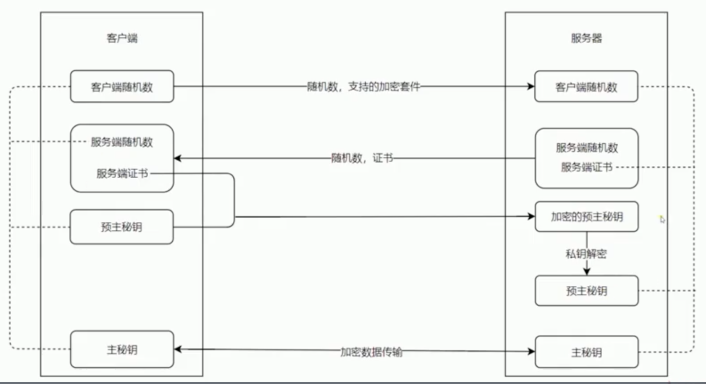

# Nginx 学习笔记
Nginx (engine x) 是一个高性能的HTTP和反向代理web服务器.

## 1. Nginx 基础配置
Mac 
安装：brew install nginx
位置：/usr/local/etc/nginx

Mac 开机启动 nginx:
```
sudo cp /usr/local/opt/nginx/*.plist /Library/LaunchDaemons
sudo launchctl load -w /Library/LaunchDaemons/homebrew.mxcl.nginx.plis
```

查看端口占用情况： sudo lsof -i :9000
杀掉端口：sudo kill -9 716 -9后面加一个空格，然后加上占用端口的进程PID

mac 配置nginx 自定义域名: vim /etc/hosts
在hosts里添加 127.0.0.1 www.xxx.com 保存并退出

sudo -s 获得超级管理员权限。
sudo -i 退出超级管理员权限。

```
server {
    listen          80
    server.name     test.com
    
    location / {
      proxy_pass    http://127.0.0.1:8888;
      # 显示原来的请求域名
      proxy_set_header  Host $host;
    }
}
```

include servers/*; servers 目录下自定义配置文件，新的站点创建新的配置文件。

nginx -T 查看nginx所有的配置

$host 是用来区分我们实际要访问的哪个服务。

server_name 在浏览器访问的.

location /  所有的请求代理到哪个地方。


## 2. Nginx 代理配置和代理缓存的用处
https://www.cnblogs.com/yyxianren/p/10832172.html
代理缓存路径

语法：proxy_cache_path path [levels=levels] keys_zone=name:size  [inactive=time] [max_size=size] 

- path 设置缓存数据存放的路径；

- levels 设置目录层级，如levels=1:2，表示有两级子目录,第一个目录名取md5值的倒数第一个值，第二个目录名取md5值的第2和3个值。

- keys_zone 设置内存zone的名字和大小，如keys_zone=my_zone:10m

- inactive 设置缓存多长时间就失效，当硬盘上的缓存数据在该时间段内没有被访问过，就会失效了，该数据就会被删除，默认为10s。

- max_size 设置硬盘中最多可以缓存多少数据，当到达该数值时，nginx会删除最少访问的数据。

```html
'content-type': 'text/html;charset=utf8',
// s-maxage 给 nginx 代理缓存用
// 浏览器用 max-age
'cache-control': 'max-age=2, s-maxage=20'

// private 用了 s-maxage 不生效
// private 告诉浏览器只有浏览器缓存，代理服务器不能缓存
'cache-control': 'max-age=2, s-maxage=20, private'

// no-store 所有地方都不缓存
'cache-control': 'max-age=5, s-maxage=20, no-store'

// vary 发送同一个请求的时，只有指定的 http header头值相同时, 才使用缓存
'vary': 'x-test-cache',
'cache-control': 's-maxage=10'

// nginx
proxy_cache_path cache levels=1:2 keys_zone=my_cache:10m;

server {
    listen          8886;
    server_name     test.com;

    location / {
        proxy_cache my_cache;
        proxy_pass  http://127.0.0.1:8888;
        proxy_set_header Host $host;
    }
}

如果 test.com 不能访问，在 hosts 文件下配置
127.0.0.1 test.com

```

## 3. HTTPS 解析


HTTPS: HyperText Transfer Protocol Secure 超文本传输安全协议. 也称为 HTTP over TLS、HTTP over SSL或HTTP Secure。

处理HTTP,HTTPS 还是用 Fiddler, 其他协议比如TCP,UDP 就用 wireshark 


加密：
- 私钥
- 公钥

证书生成：
openssl req -x509 -newkey rsa:2048 -nodes -sha256 -keyout localhost-privkey.pem -out localhost-cert.pem

ssl on; // 最新版本不需要手动开启ssl, 默认已经开启了

server {
    listen          80 default_server;
    listen          [::]:80 default_server;
    server_name     test.com;
    return          302 https://$server_name$request_uri;
}
ssl_certificate_key ./certs/localhost-privkey.pem;
ssl_certificate ./certs/localhost-cert.pem;


## 4-5 HTTP2的优势和Nginx配置HTTP2的简单使用

Chrome 并发连接数限制.

- 信道复用
- 分帧复用
- Server Push

```
# 开启 https http2
listen 443 ssl http2;
# 要使用 Server Push, Link
http2_push_preload on;
```
    
查看H2 chrome://net-internals/http2

HTTP/2 LAB 性能对比:
https://http2.akamai.com/demo/http2-lab.html

curl -v wx.localhost.com
curl -v https://wx.localhost.com
curl -v -k https://wx.localhost.com
curl -v -k http1.1 https://wx.localhost.com

Nginx 在不支持 http2 的默认开启了 ALPN