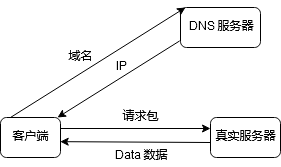
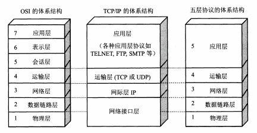
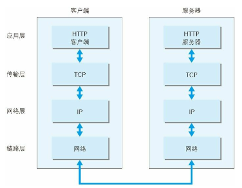

# 程序员需要理解的 HTTP 协议
- 网络协议7层、5层、4层是什么, 区别是啥？
- TCP/IP 通信传输流是如何流转的?

## 前言
> HTTP 协议（HyperText Transfer Protocol， 超文本传输协议). HTTP 协议是基于 TCP 协议出现的, 规定了 Request-Response 的模式。这个模式决定了通讯必定是由客户端首先发起的。

计算机之间的通信是通过 IP 来实现的, 域名只是让大家更好的记住。

当在在浏览器输入一个 URL, 经过 DNS 查询把 IP 返回给浏览器, 浏览器再拿这个 IP 请求真正的服务器.

## 一. 概念介绍
各层对应图：

7层是指OSI七层协议模型，主要是：应用层（Application）、表示层（Presentation）、会话层（Session）、传输层（Transport）、网络层（Network）、数据链路层（Data Link）、物理层（Physical）。

5层只是OSI和TCP/IP的综合，是业界产生出来的非官方协议模型。五层体系结构包括：应用层、传输层、网络层、数据链路层和物理层。 

4层是指TCP/IP四层模型，主要包括：应用层、传输层、网络层和链路层。
链路层（又名数据链路层，网络接口层）。

OSI是一种理论下的模型，而 TCP/IP 已被广泛使用，成为网络互联事实上的标准。HTTP 是属于 TCP/IP 协议族的一个子集。

相关专业名词:
- OSI（Open System Interconnect）：开放式系统互联。
- TCP/IP (Transmission Control Protocol / Internet Protocol)：指传输控制协议/网际协议。
- HTTP （HyperText Transfer Protocol)：超文本传输协议，位于应用层。
- DNS(Domain Name System): 域名系统，位于应用层。
- IP（ Internet Protocol）：网际协议，位于网络层。
- UDP（ User Data Protocol）：用户数据报协议，位于传输层。
- TCP（ Transmission Control Protocol）：传输控制协议，位于传输层。

## 二. TCP/IP 协议族各层作用
- 应用层 \
向应用软件提供服务。如 FTP、DNS、HTTP 等。

- 传输层 \
传输层对上层应用层，提供两台计算机间的数据传输。
如：TCP（Transmission Control Protocol， 传输控制协议） 和 UDP（User Data Protocol， 用户数据报 协议）。
HTTP 就是构建于 TCP/IP 协议之上。

- 网络层 \
网络层用来处理在网络上流动的数据包。数据包是网络传输的最小数据单位。
网络层所起的作用就是在众多的选项内选择一条传输路线。 IP (IPv4 · IPv6) 

- 数据链路层 \
用来处理连接网络的硬件部分。如：Mac地址、电脑的硬件、网卡、网线、光缆等。

## 三. TCP/IP 通信传输流

利用 TCP/IP 协议族进行网络通信时，会通过分层顺序与对方进行通信。 发送端从应用层往下走，接收端则往应用层往上走。

## 四. 与 HTTP 关系密切的协议：IP、TCP 和 DNS

- 负责传输的 IP 协议

IP（ Internet Protocol） 网际协议位于网络层。

IP 协议的作用是把各种数据包传送给对方。 而要保证确实传送到对方那里， 则需要满足各类条件。 其中两个重要的条件是 IP 地址和 MAC地址（ Media Access Control Address）。

IP 地址指明了节点被分配到的地址， MAC 地址是指网卡所属的固定
地址。

- 确保可靠性的 TCP 协议

按层次分，TCP 位于传输层，提供可靠的字节流服务。

所谓的字节流服务（ Byte Stream Service） 是指， 为了方便传输， 将大块数据分割成以报文段（ segment） 为单位的数据包进行管理。而可靠的传输服务是指，能够把数据准确可靠地传给对方。

确保数据能到达目标

为了准确无误地将数据送达目标处，TCP 协议采用了三次握手
（ three-way handshaking）策略。 

## 安全
"内容安全策略"(Content Security Policy,缩写 CSP)

### 文章参考
- [一文读懂OSI七层模型与TCP/IP四层的区别/联系](https://blog.csdn.net/qq_39521554/article/details/79894501)
- 图解 HTTP