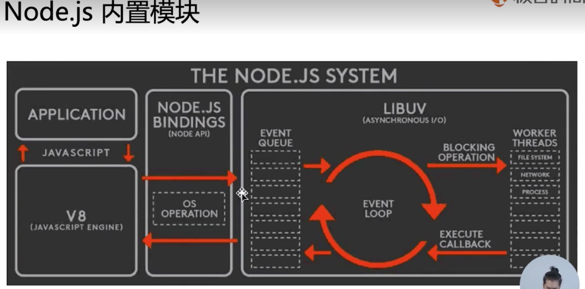

# Node.js 简介

Node.js 是一个基于 `Chrome V8` 引擎的 JavaScript 运行环境。

Node.js 使用了一个`事件驱动`、`非阻塞式 I/O` 的模型，使其轻量又高效。

## 1. 什么是技术预研
- 分析要做的需求，找出技术难点
- 针对每个技术难点进行攻克

## BFF 层
Backend for Frontend 服务于前端的后端
- 对用户侧提供 HTTP 服务
- 使用后端 RPC 服务

## node API
- requestAnimationFrame
- setImmediate
- process

## 2. Node.js 内置模块

OS 模块 - 操作系统相关



### 3. process 进程

process.argv 属性返回一个数组，其中包含当启动 Node.js 进程时传入的命令行参数
```javascript
let count = 0
process.stdin.on('data', e => {
  const playAction = e.toString().trim()
  const result = game(playAction)

  if (result === 1) {
    count++
    console.log(`你赢了 ${count} 次`)
  }

  if (count === 3) {
    console.log(`你赢了 ${count} 次, 我不玩了，退出！`)
    process.exit() // 退出
  }
})
```

### 4. events 事件触发器
EventEmitter
- 观察者模式 - addEventListener-removeEventListener
- 调用 vs 抛事件
• 关键在于“不知道被通知者存在”
• 以及“没有人听还能继续下去

```javascript
// 把抛事件的模块封装起来
// 强调抛事件这种模式更适合底层模块往外传递信息
const course = require('./course')
// 事件监听器
course.on('newLesson', (({ price }) => {
  if (price < 80) {
    console.log('I will buy but cost less 80. price:', price)
  } else {
    console.log('not buy. price:', price)
  }
}))

// course.js
const EventEmitter = require('events')
// 把抛事件的模块封装起来
// 强调抛事件这种模式更适合底层模块往外传递信息
class Course extends EventEmitter {
  constructor () {
    super()
    setInterval(() => {
      this.emit('newLesson', {
        price: Math.random() * 100,
        name: '触发事件'
      })
    }, 2000)
  }
}

module.exports = new Course
```


## 5. node.js 异步
- 事件循环
- 非阻塞 I/O

### 非阻塞 I/O
I/O Input/Output, 一个系统的输入和输出

理解非阻塞 I/O的要点：
- 确定一个进行 Input/Output 的系统
- 思考在 I/O 过程中，能不能进行其他 I/O

glob
```javascript
// 同步递归读取所有文件和文件夹
glob.sync(__dirname + '/**/*')

// 非阻塞I/O - 回调
glob(__dirname + '/**/*', function (err, files) { // 同步
 console.log(files)
})
```

## 5.1 Node.js 异步编程 - callback

回调函数格式规范
 - error-first callback
 - Node-style callback

第一个参数是 error, 后面的参数才是结果

异步流程控制， 异步的并发

npm: async
thunk


## 6. 事件循环
每个事件循环都是一个全新的调用栈。

宏观任务的队列就相当于事件循环。

函数调函数会形成调用栈
try-catch 机制
每个事件循环都是一个全新的调用栈。
setTimeout 是在另一个事件循环回调的，所以被抛到全局


## 7. Promise - 异步编程
> 概念: Promise 是一个对象，它代表了一个异步操作的最终完成或者失败。
当前事件循环得不到结果，但未来事件循环会得到结果。

是一个状态机：
- 3个状态：pending, resolved/filled, rejected
- 如果是 pending 转为 reject 需要 catch或then 错误处理。

执行 then 和 catch 会返回一个新 Promise，该 Promise 最终状态根据 then 和 catch 的回调函数的执行结果决定

- 如果回调函数最终是 throw，该 Promise 是 rejected 状态

- 如果回调函数最终是 return，该 Promise 是 resolved 状态

- 但如果回调函数最终 return 了一个 Promise ，该 Promise 会和回调函数 return 的Promise 状态保持一致
  
  
## 8. Node.js 异步编程 – async/await

async/await:
- async function 是 Promise 的语法糖封装
- 异步编程的终极方案 – 以同步的方式写异步
  - await 关键字可以“暂停”async function的执行
  
  - await 关键字可以以同步的写法获取 Promise 的执行结果
  
  - try-catch 可以获取 await 所得到的错误. 平常的异步任务 try-catch 是捕捉不到的.
  
- 一个穿越事件循环存在的 function

## 9. 什么是 HTTP 服务

超文本传输协议.Hypertext Transfer Protocol

什么是 HTTP 服务
- 应用层协议
- 五层网络协议。
  5. 应用层
  4. 传输层/运输层
  3. 网络层
  2. 数据链路层
  1. 物理层


一个网页请求，包含两次 HTTP 包交换：
- 浏览器向 HTTP 服务器发送请求 HTTP 包
- HTTP 服务器向浏览器返回 HTTP 包
- 而建立连接是通过 TCP connection

## 10. 网页版石头剪刀布，原生 Node.js 前后端交互

## 11. Express
要了解一个框架，最好的方法是：
- 了解它的关键功能
- 推导出它要解决的问题是什么。

Features 特征:
- Robust routing - 健壮的路由系统
- Focus on high performance - 专注于高性能
- Super-high test coverage - 超高测试覆盖率

- HTTP helpers (redirection, caching, etc)HTTP帮助程序（重定向，缓存等）

- View system supporting 14+ template engines 查看系统支持14个以上模板引擎

- Content negotiation - 内容协商
- Executable for generating applications quickly 可执行以快速生成应用程序的脚手架。

解决的问题：
- 路由功能。
- HTTP 处理功能
- 模板引擎
- 脚手架，快速上手

通过 app.use 添加逻辑.

express 提供的一个中间件的能力。通过 next 把很长的逻辑分开到不同的部分。

通过 next 执行后续中间件

## 11. Koa
- 中间件
- context

核心功能：
使用 async function 实现的中间件:
- 有'暂停执行'的能力
- 在异步的情况下也符合洋葱模型
- 精简内核，所有额外功能都移到中间件里实现。 

Express vs Koa
- express 门槛更低，koa 更强大优雅
- express 封装更多东西，开发更快速, koa 定制型更高


## 12. RPC 调用

Remote Procedure Call（远程过程调用）

和 Ajax 有什么相同点?
- 都是两个计算机之间的网络通信
- 需要双方约定一个数据格式

和 Ajax 有什么不同点?
- 不一定使用 DNS 作为寻址服务
- 应用层协议一般不使用 HTTP
- 基于 TCP 或 UDP 协议

区别1：Ajax 寻址/负载均衡
- Ajax：使用 DNS 进行寻址, 计算机通讯是用 IP 地址的

RPC 寻址/负载均衡
- RPC：使用特有服务进行寻址。

区别2：TCP 通信方式
- 单工通信，只能单向的发包。
- 半双工通信，同一时间内只能单向的发包，要等到完全后，再向另一方发包。也可以理解为轮番单工通信。
- 全双工通信，比较自由的通信方式。实现难度和实现成本。

区别3：二进制协议
- 更小的数据包体积
- 更快的编解码速率。 因为二进制协议更加接近计算机协议的形式，而文本协议是更适合人的理解。

RPC 二进制流[0001 0000 1111 1100], 不同的字段代表不同的位数，RPC 通信一般是服务端到服务端

Http 协议很简单，是一个文本协议。一般就是 html 或 json(key: value)

寻址/负载均衡一般是运维来消化，多路复用和二进制协议一般需要 BFF 层消化。


## 13. Node.js Buffer 编解码二进制数据包

Buffer是node的核心模块，开发者可以利用它来处理二进制数据，比如文件流的读写、网络请求数据的处理等。

Buffer 类，用于在 TCP 流、文件系统操作、以及其他上下文中与八位字节流进行交互。
 
 常用方法:
 - Buffer.from 从现有的数据结构创建 字符串、数字数组
 - Buffer.alloc 指定 buffer 的长度
 - buf.writeInt16BE

LE-BE, 大小端问题 - 几个 Byte 里，高位与低位的编排顺序不同。

处理方法与 string 接近。

Protocol Buffer
- protocol-buffers
- Google 研发的二进制协议编解码库
- 通过协议文件控制 Buffer 的格式。 更直观，更好维护，更便于合作

protocol-buffers
```javascript
const fs = require('fs')
const protobuf = require('protocol-buffers')

const schema = protobuf(fs.readFileSync(__dirname + '/test.proto', 'utf-8'))

console.log(schema)

const buf = schema.Column.encode({
  id: 1,
  name: 'Node.js',
  price: 98.4
})
console.log('解码：', schema.Column.decode(buf))

```

## 14. Node.js net 搭建多路复用的 RPC 通道
多路复用就是在一个通信通路（tcp连接）上多次进行通信，减少建立连接的消耗。所以最好要求通信通路支持全双工通信

- 单工/半双工的通信通道搭建
时序问题。同一时间内只有一个方向通信。不能交叉。

rpc和ajax就是差不多的东西，ajax的底层、http1.1的底层也就是半双工通信。

Node.js net 模块
- 全双工的通信通道搭建
  - 关键在于应用层协议需要有标记包号的字段
  - 处理以下情况，需要有标记包长的字段
    - 粘包
    - 不完整包
  - 错误处理
  
seq 包序号

Socket 代表网络通路的写入与取出的代理对象


### Node.js 数据通信, Net 模块
关于 NodeJS 的数据通信，最基础的两个模块是 NET 和 HTTP，前者是基于 TCP 的封装，后者本质还是 TCP 层，只不过做了比较多的数据封装，我们视之为更高层。

管道（pipe）.

### Net
net 模块用于创建基于流的 TCP 服务器与客户端（net.createConnection()）。

http.Server继承了net.Server，此外，http客户端与http服务端的通信均依赖于socket（net.Socket）

net模块主要包含两部分:
- net.Server：TCP server，内部通过socket来实现与客户端的通信。
- net.Socket：tcp/本地 socket的node版实现，它实现了全双工的stream接口。

### 基于事件
NodeJS 的 EventEmitter 模块。这个模块就是一个事件中心.NET 模块是继承 EventEmitter 的.

```javascript
class EventEmitter {
  constructor () {
    this._events = {}
  }
  // on 监听事件
  on (event, cb) {
    const arr = this._events[event] || []
    arr.push(cb)
    this._events[event] = arr
  }
  // emit 触发事件
  emit (event, ...args) {
    const callbacks = this._events[event]
    if (callbacks) {
      callbacks.map(event => event.call(this, ...args))
    }
  }
}
```

### 文章参考
-  [net 模块,数据通信](https://www.cnblogs.com/hustskyking/archive/2014/04/22/nodejs-net-module.html)
- [Node.js 学习](https://github.com/chyingp/nodejs-learning-guide)

