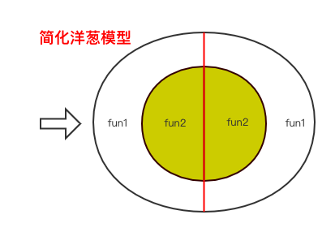

## 1. 洋葱模型

Koa.js 经典的 `洋葱模型` 中间件处理流程。

洋葱模型简化图示:


洋葱模型示例：
```javascript
const app = new (require('koa'))
// 洋葱模型 1 3 4 2
app.use(async (ctx, next) => {
  console.log(1)
  await next()
  console.log(2)
})
app.use(async (ctx, next) => {
  console.log(3)
  await next()
  console.log(4)
})
app.listen(3000)
```


## 2. 全局异常处理中间件

- 异常处理
    - 已知异常
    - 未知异常
    
- Promise
    - async
    - await
    
### require-directory 遍历目录

递归地遍历指定的目录，要求对每个文件使用（），并返回包含这些模块的嵌套哈希结构。

## 3. 参数请求

1. 路径 path, ctx.params
2. 查询字符串 ctx.request.query
3. 请求头 header: ctx.request.header
4. 请求体 body json格式： ctx.request.body


## 遗留问题：
- http.IncomingMessage


## HTTPS 
阿里云有一年的免费试用，lets encrypt, 3个月续期