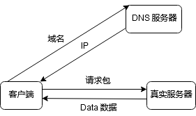

# 前端需要了解的 HTTP 协议

在进入学习 HTTP 协议之前, 首先了解一下经典的五层网络模型(协议):

## 五层网络模型
- 应用层 \
向应用软件提供服务。如 FTP、DNS、HTTP 等。

- 传输层 \
传输层对上层应用层，提供两台计算机间的数据传输。
如：TCP（Transmission Control Protocol， 传输控制协议） 和 UDP（User Data Protocol， 用户数据报 协议）。
HTTP 就是构建于 TCP/IP 协议之上。

- 网络层 \
网络层用来处理在网络上流动的数据包。数据包是网络传输的最小数据单位。
网络层所起的作用就是在众多的选项内选择一条传输路线。 IP (IPv4 · IPv6) 

- 数据链路层 \
数据链路层在通信的实体间建立数据链路连接。

- 物理层 \
物理层主要作用是定义物理设备如何传输数据。如：电脑的硬件、网卡、网线、光缆等

## 引言
> HTTP 协议（HyperText Transfer Protocol， 超文本传输协议). HTTP 协议是基于 TCP 协议出现的, 规定了 Request-Response 的模式。这个模式决定了通讯必定是由浏览器端首先发起的。

我们知道计算机之间的通信是通过 IP 来实现的, 域名只是让大家更好的记住.

当在在浏览器输入一个 URL, 经过 DNS 查询把 IP 返回给浏览器, 浏览器再拿这个 IP 请求真正的服务器.

