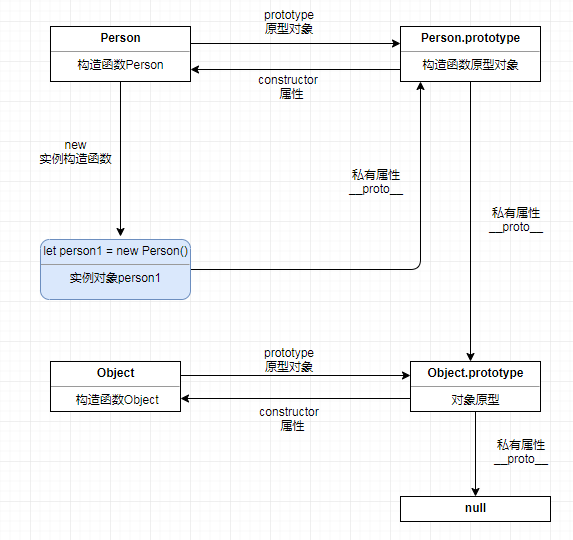

# 继承与原型链

> 当谈到继承时，JavaScript 只有一种结构：对象。每个实例对象（ object ）都有一个私有属性（称之为 `__proto__` ）指向它的构造函数的原型对象（prototype ）。该原型对象也有一个自己的原型对象( `__proto__ `) ，层层向上直到一个对象的原型对象为 null。根据定义，null 没有原型，并作为这个原型链中的最后一个环节。

几乎所有 JavaScript 中的对象都是位于原型链顶端的 Object 的实例。



### 基于原型链的继承

- 继承属性

> JavaScript 对象是动态的属性“包”（指其自己的属性）。JavaScript 对象有一个指向一个原型对象的链。当试图访问一个对象的属性时，它不仅仅在该对象上搜寻，还会搜寻该对象的原型，以及该对象的原型的原型，依次层层向上搜索，直到找到一个名字匹配的属性或到达原型链的末尾。

```javascript
// 继承只有一种结构：对象
function Person () { }
let person1 = new Person()

console.log('原型对象 constructor 指向构造函数：',
  Person.prototype.constructor === Person)

// __proto__
console.log('1.0 实例 person1, 私有属性 __proto__:',
  person1.__proto__ === Person.prototype) // true

console.log('2.0 原型对象 Person.prototype 私有属性 __proto_:',
  Person.prototype.__proto__ === Object.prototype)

console.log('3.0 层层向上直到未端为 null:', Object.prototype.__proto__)

console.log(Array(30).join('-'), 'Object.getPrototypeOf', Array(30).join('-'))

// ES6 Object.getPrototypeOf
console.log('1.1 ES6原型对象 Person.prototype 私有属性 __proto_:',
  Object.getPrototypeOf(Person.prototype) === Object.prototype)
console.log('2.1 ES6实例 person1, 私有属性 getPrototypeOf:',
  Object.getPrototypeOf(person1) === Person.prototype) // true
console.log('3.1 层层向上直到未端为 null:', Object.getPrototypeOf(Object.prototype))

// 设置一个指定的对象的原型 ( 即, 内部[[Prototype]]属性）到另一个对象或  null。
Object.setPrototypeOf(person1, null)
// Object.setPrototypeOf(person1, Person.prototype)
console.log('Object.setPrototypeOf(person1):', Object.getPrototypeOf(person1))
console.log('Object.setPrototypeOf():', Object.getPrototypeOf(person1) === Person.prototype)
```

- 继承方法

> JavaScript 并没有其他基于类的语言所定义的“方法”。在 JavaScript 里，任何函数都可以添加到对象上作为对象的属性。

当继承的函数被调用时，this 指向的是当前继承的对象，而不是继承的函数所在的原型对象。
```javascript
  // 继承方法
  var obj = {
    a: 11,
    add () {
      return this.a + 1
    }
  }
  console.log('obj.add:', obj.add()) // 12
  // 当继承的函数被调用时，this 指向的是当前继承的对象，而不是继承的函数所在的原型对象。
  var ins = Object.create(obj)
  ins.a = 31
  console.log('ins.add:', ins.add()) // 32
```


### 使用不同的方法来创建对象和生成原型链
- 使用 Object.create 创建的对象

- 使用 class 关键字创建的对象
```javascript
  console.log(Array(30).join('-'), '使用 class 关键字创建对象，生成原型链', Array(30).join('-'))
  class Polygon {
    constructor (width, height) {
      this.width = width
      this.height = height
    }
  }

  class Square extends Polygon {
    // 边长
    constructor (sideLength) {
      super(sideLength, sideLength)
    }
    // 面积
    get area () {
      return this.width * this.height
    }
    // 设置新的边长
    set sideLength (newLength) {
      this.width = newLength
      this.height = newLength
    }
  }
  const square = new Square(10)
  console.log('sideLength=10 square.area:', square.area)
  square.sideLength = 5
  console.log('new sideLength=5 square.area:', square.area)
```