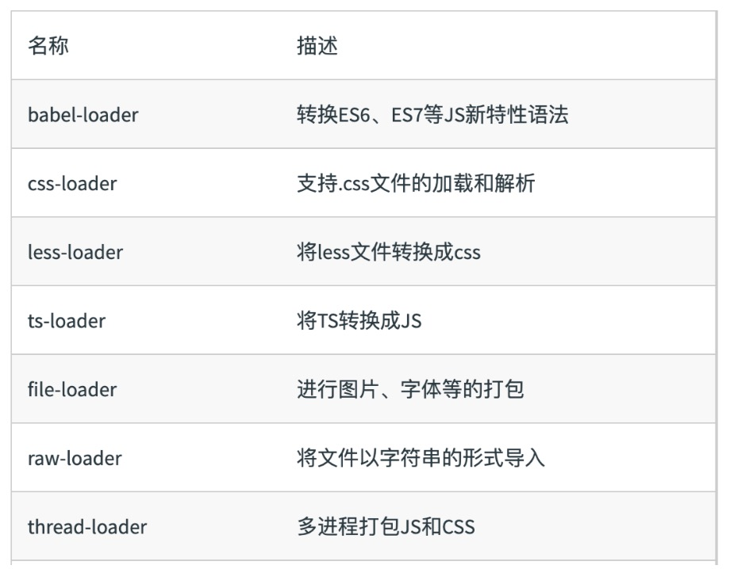
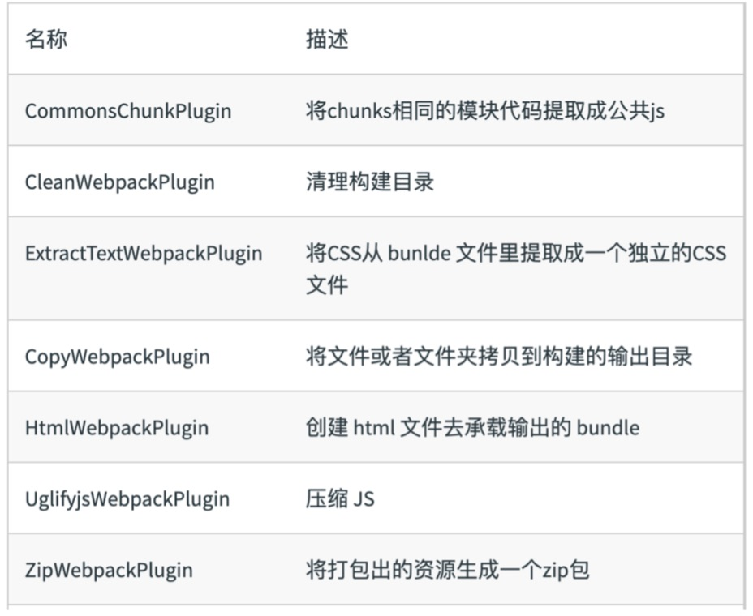
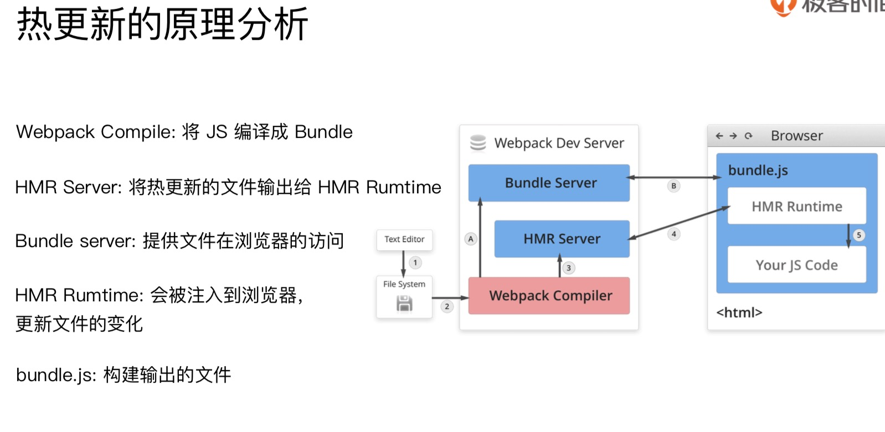

Webpack 概念
> 本质上，webpack 是一个现代 JavaScript 应用程序的静态模块打包器(module bundler)。当 webpack 处理应用程序时，它会递归地构建一个依赖关系图(dependency graph)，其中包含应用程序需要的每个模块，然后将所有这些模块打包成一个或多个 bundle。

# webpack 基础用法

### 1. 核心概念之 entry
单入口是一个字符串，多入口是一个对象
```
// 单入口是一个字符串
entry: './src/index.js'
// 多入口-多页面配置
entry: {
 index: './src/index.js',
 search: './src/search.js',
}
```

### 2. 核心概念之 output
通过占位符确保文件名称的唯一。`filename: '[name].js'`
```javascript
module.exports = {
  // 多入口-多页面配置
  entry: {
    index: './src/index.js',
    search: './src/search.js',
  },
  output: {
    filename: '[name].js', // 多页面配置
    path: path.resolve(__dirname, 'dist')
  }
}
```

### 3. 核心概念之 Loaders
> 定义: 只是一个导出为函数的 JavaScript 模块。
多个 loader 串行执行，顺序从后到前。


```javascript
module.exports = function(source) {
  return source
}

{
  test: /\.js/,
  use: [
    'bar-loader',
    'foo-loader'
  ]
}
```

webpack 开箱即用只支持 JS 和 JSON 两种文件类型，通过 Loaders 去支持其它文件类型并且把它们转化成有效的模块，并且可以添加到依赖图中。

本质上，webpack loader 将所有类型的文件，转换为应用程序的依赖图（和最终的 bundle）可以直接引用的模块。

本身是一个函数，接受源文件作为参数，返回转换的结果。

常见的 Loaders 有哪些?


### 4. 核心概念之 Plugins

插件用于 bundle 文件的优化，资源管理理和环境变量量注⼊入 

作⽤用于整个构建过程

常⻅见的 Plugins 有哪些?

```
  plugins: [
    new HTMLWebpackPlugin({
      template: './src/index.html'
    })
  ]
```

### 5. 核心概念之 Mode
Mode ⽤来指定当前的构建环境是:production、development 还是 none 

设置 mode 可以使用 webpack 内置的函数，默认值为 production

### 6.1 资源解析: 增加 ES6 的 babel preset 配置

安装 babel-loader
```html
安装:
npm install -D babel-loader @babel/core @babel/preset-env

.babelrc
{
  "presets": [
    "@babel/preset-env",
    "@babel/preset-react"
  ]
}

webpack.config.js
module: {
    rules: [
      { test: /.js$/, use: 'babel-loader'}
    ]
}
```
presets 是一系列 plugins 的集合
一个 plugins 对应一个功能

### 6.2 资源解析: 解析 React JSX
安装 `react react-dom @babel/preset-react`
```html
npm i react react-dom @babel/preset-react -D
```

### 6.3 资源解析:解析 CSS
css-loader 用于加载 .css ⽂件，并且转换成 commonjs 对象

style-loader 将样式通过 <style> 标签插入到 head 中

```html
sudo yarn add --dev css-loader style-loader
sudo yarn add --dev less less-loader
```

### 6.4 资源解析:解析图⽚片 file-loader
```html
sudo yarn add --dev file-loader
```

### 6.5 资源解析:使⽤用 url-loader
url-loader 也可以处理图片和字体.
可以设置较⼩资源⾃动 base64
```html
sudo yarn add --dev url-loader
```

### 7.0 webpack 中的文件监听使⽤
webpack 开启监听模式，有两种⽅方式: 
- 启动 webpack 命令时，带上 --watch 参数 
- 在配置 webpack.config.js 中设置 watch: true

唯一缺陷:每次需要⼿手动刷新浏览器器

### 7.1 ⽂件监听的原理分析

轮询判断⽂件的最后编辑时间是否变化
 
某个⽂件发⽣生了了变化，并不会立刻告诉监听者，而是先缓存起来，等 aggregateTimeout
```javascript
module.exports = {
  // 文件监听，放到硬盘中
    watch: true,
    // 只有开启监听模式时，watchOptions才有意义
    watchOptions: {
      // 默认为空，不监听的文件或者文件夹，支持正则匹配
      ignored: /node_modules/,
      // 监听到变化发生后会等300ms再去执行，默认300ms
      aggregateTimeout: 300,
      // 判断文件是否发生变化是通过不停询问系统指定文件有没有变化实现的，默认每秒问1000次
      poll: 1000
    },
}
```

### 8.0 热更新:webpack-dev-server
WDS 不刷新浏览器,WDS 不输出文件，而是放在内存中

使⽤模块热更新，HotModuleReplacementPlugin 插件

```html
sudo yarn add --dev webpack-dev-server

  plugins: [
    new webpack.HotModuleReplacementPlugin()
  ],
  // mode: 'production'
  mode: 'development',
  devServer: {
    contentBase: './dist',
    // 热更新
    hot: true
  }

```

热更新分两个阶段，启动阶段还是依赖磁盘文件去编译。更新阶段是直接内存增量更新的

这里面的热更新有最核心的是 HMR Server 和 HMR runtime。

HMR Server 是服务端，用来将变化的 js 模块通过 websocket 的消息通知给浏览器端。

HMR Runtime 是浏览器端，用于接受 HMR Server 传递的模块数据，浏览器端可以看到 .hot-update.json 的文件过来。

HotModuleReplacementPlugin是做什么用的？

webpack 构建出来的 bundle.js 本身是不具备热更新的能力的，HotModuleReplacementPlugin 的作用就是将 HMR runtime 注入到 bundle.js，使得bundle.js可以和HMR server建立websocket的通信连接

### 8.1 热更新的原理理分析


### 8.2 热更新:使用 webpack-dev-middleware
WDM 将 webpack 输出的文件传输给服务器器 适⽤用于灵活的定制场景
```javascript
const express = require('express');
const webpack = require('webpack');
const webpackDevMiddleware = require('webpack-dev- middleware');
const app = express();
const config = require('./webpack.config.js'); const compiler = webpack(config);
app.use(webpackDevMiddleware(compiler, { publicPath: config.output.publicPath
}));
app.listen(3000, function () {
console.log('Example app listening on port 3000!\n');
});
```

### 9. 什么是文件指纹?
打包后输出的⽂件名的后缀

文件指纹如何⽣生成？
- Hash:和整个项⽬目的构建相关，只要项⽬文件有修改，整个项⽬目构建的 hash 值就会更更改
- Chunkhash：和 webpack 打包的 chunk 有关，不同的 entry 会⽣成不同的 chunkhash 值
- Contenthash：根据⽂件内容来定义 hash ，⽂件内容不变，则 contenthash 不变


JS 的⽂件指纹设置, 设置 output 的 filename，使⽤ [chunkhash]

抽成 css 文件，而不是 style
```
const MiniCssExtractPlugin = require('mini-css-extract-plugin')
  {
    test: /.css$/,
    use: [
      // 'style-loader',
      MiniCssExtractPlugin.loader,
      'css-loader'
    ]
  },
  {
    test: /.less$/,
    use: [
      // 'style-loader',
      MiniCssExtractPlugin.loader,
      'css-loader',
      'less-loader'
    ]
  }
```


[name]_[hash:8].js

### 10. 代码压缩

- HTML 压缩
- CSS 压缩
- JS 压缩

JS ⽂件的压缩，内置了 uglifyjs-webpack-plugin

CSS ⽂件的压缩，使⽤ optimize-css-assets-webpack-plugin。同时使⽤ cssnano
```html
new OptimizeCSSAssetsPlugin({
  assetNameRegExp: /\.css$/g,
  cssProcessor: require('cssnano')
})
```


html ⽂件的压缩,修改 html-webpack-plugin， 设置压缩参数
```html
new HtmlWebpackPlugin({
  template: path.join(__dirname, 'src/index.html'),
  filename: 'index.html',
  chunks: ['index'],
  inject: true,
  minify: {
    html5: true,
    collapseWhitespace: true,
    preserveLineBreaks: false,
    minifyCSS: true,
    minifyJS: true,
    removeComments: false
  }
})
```