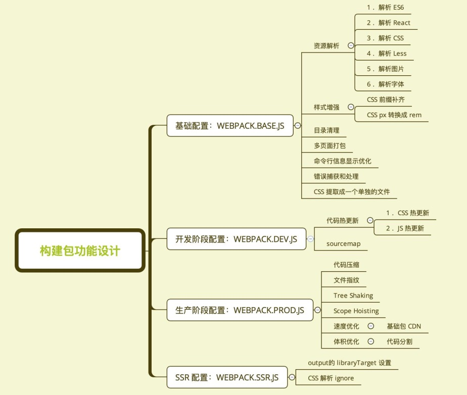

# 4. 编写可维护的 webpack 构建配置

## 4.1 构建配置抽离成 npm 包的意义
通用性
- 业务开发者无需关注构建配置
- 统一团队构建脚本

可维护性
- 构建配置合理的拆分
- README 文档、 ChangeLog 文档等

质量
- 冒烟测试、 单元测试、 测试覆盖率
- 持续集成


构建配置管理的可选方案

- 通过多个配置文件管理不同环境的构建， webpack --config 参数进行控制
- 将构建配置设计成一个库， 比如： hjs-webpack、 Neutrino、 webpack-blocks
- 抽成一个工具进行管理， 比如： create-react-app, kyt, nwb
- 将所有的配置放在一个文件， 通过 --env 参数控制分支选择


## 4.2 构建配置包设计
通过多个配置文件管理不同环境的 webpack 配置

- 基础配置： webpack.base.js
- 开发环境： webpack.dev.js
- ·生产环境： webpack.prod.js
- SSR环境： webpack.ssr.js

抽离成一个 npm 包统一管理
- 规范： Git commit日志、 README、 ESLint 规范、 Semver 规范
- 质量： 冒烟测试、 单元测试、 测试覆盖率和 CI

通过 webpack-merge 组合配置
```html
merge = require("webpack-merge")
合并配置： module.exports = merge(baseConfig, devConfig);
```


功能模块设计



## 4.3 使用 ESLint 规范构建脚本
使用 eslint-config-airbnb-base

eslint --fix 可以自动处理空格

## 43 | 持续集成和Travis CI

优点：
- 快速发现错误
- 防止分支大幅偏离主干

核心措施是， 代码集成到主干之前， 必须通过自动化测试。 只要有一个测试用例失败，就不能集成。


接入 Travis CI
1. https://travis-ci.org/ 使用 GitHub 账号登录
2. 在 https://travis-ci.org/account/repositories 为项目开启
3. 项目根目录下新增 .travis.yml


复制目录:
cp -r ~/my-project/build

http://www.ruanyifeng.com/blog/2017/12/travis_ci_tutorial.html

## 44 | 发布构建包到npm社区

npm login

发布到 npm。
添加用户： npm adduser

升级版本：
- 升级补丁版本号： npm version patch
- 升级小版本号： npm version minor
- 升级大版本号： npm version major

发布版本： npm publish